# WebAssembly Crypto++ as a Browser Module

## Description

Browser cryptography capabilities are limited, this project attempt to fix that.

Definition file is provided for TypeScript (or limited JavaScript autocompletion).

Works in a Node.js context (if you don't like the crypto module...?).

Unit tested:
* C++ code rely on GoogleTest
* TypeScript code rely on jest

It should be possible to expose most Crypto++ capabilities.

---

### Current Capabilities

#### AES Symmetric Cipher:
  * encrypt
  * decrypt

#### Diffie Hellman Client:
  * generateKeys
  * computeSharedSecret

#### Auto Seeded Random Pool:
  * secure random N random bytes (as hexadecimal string)

### RSA features:
  * generate random private keys
  * PEM import/export of private/public keys
  * sign with private keys
  * verify with public keys

---

# Online Demo Link(s)

**`/!\ important /!\`**

## Demo 1:
http://guillaumebouchetepitech.github.io/wasm-cryptopp-as-module/samples/interactive/index.html

## Demo 2:
http://guillaumebouchetepitech.github.io/wasm-cryptopp-as-module/samples/basic/index.html

**`/!\ important /!\`**

# Diagrams

```mermaid


  sequenceDiagram

    box rgb(128,64,64) client_a_MS & client_a_WS_dh & client_WS_sc

      participant client_a_MS as Client A<br>Main Script
      participant client_a_WS_dh as Client A<br>Worker Script<br>Diffie Hellman<br>RSA
      participant client_WS_sc as Client A<br>Worker Script<br>Symmetric Cipher

    end

    box rgb(64,64,128) client_b_MS & client_b_WS_dh & client_b_WS_sc

      participant client_b_WS_sc as Client B<br>Worker Script<br>Symmetric Cipher
      participant client_b_WS_dh as Client B<br>Worker Script<br>Diffie Hellman<br>RSA
      participant client_b_MS as Client B<br>Main Script

    end

    Note over client_a_MS,client_b_MS: both client are connected


    Note over client_a_MS: possess Client A private key
    Note over client_a_MS: possess Client B public key
    Note over client_b_MS: possess Client B private key
    Note over client_b_MS: possess Client A public key

    client_a_MS->>+client_a_WS_dh: request payload<br>secure connection

    Note over client_a_WS_dh: generate Diffie Hellman keys
    Note over client_a_WS_dh: generate symmetric cipher iv value
    Note over client_a_WS_dh: load RSA PEM<br>(Client B public key)
    Note over client_a_WS_dh: sign payload<br>-> symmetric cipher iv value<br>-> Diffie Hellman public key (Client A)

    client_a_WS_dh-->>-client_a_MS: provide payload<br>secure connection

    rect rgb(128, 128, 128)
      client_a_MS->>client_b_MS: send request for secure connection<br>signed payload<br>-> symmetric cipher iv value<br>-> Diffie Hellman public key (Client A)
    end

    client_b_MS->>+client_b_WS_dh: handle payload<br>secure connection

    Note over client_b_WS_dh: load RSA PEM<br>(Client A private key)
    Note over client_b_WS_dh: verify payload<br>-> symmetric cipher iv value<br>-> Diffie Hellman public key (Client A)
    Note over client_b_WS_dh: generate Diffie Hellman keys (Client B)
    Note over client_b_WS_dh: compute<br>Diffie Hellman<br>shared secret
    Note over client_b_WS_dh: load RSA PEM<br>(Client B public key)
    Note over client_b_WS_dh: sign payload<br>-> Diffie Hellman public key (Client B)

    client_b_WS_dh-->>-client_b_MS: provide payload<br>secure connection response<br>provide data<br>Diffie Hellman shared secret (Client B)

    rect rgb(128, 128, 128)

      client_b_MS-->>client_a_MS: send response of secure connection request<br>signed payload<br>-> Diffie Hellman public key (Client B)

    end

    client_a_MS->>+client_a_WS_dh: process secure connection<br>response payload

    Note over client_a_WS_dh: load RSA PEM<br>(Client B public key)
    Note over client_a_WS_dh: verify payload<br>-> Diffie Hellman public key (Client B)
    Note over client_a_WS_dh: compute<br>Diffie Hellman<br>shared secret

    client_a_WS_dh-->>-client_a_MS: provide<br>* Diffie Hellman shared secret

    Note over client_a_MS,client_b_MS: both client are authenticated to each other and share the same secret

    client_a_MS->>+client_WS_sc: initialize Symmetric Cipher<br>with Diffie Hellman shared secret
    Note over client_WS_sc: set Symmetric Cipher key
    client_WS_sc-->>-client_a_MS: ready

    client_b_MS->>+client_b_WS_sc: initialize Symmetric Cipher<br>with Diffie Hellman shared secret
    Note over client_b_WS_sc: set Symmetric Cipher key
    client_b_WS_sc-->>-client_b_MS: ready

    Note over client_a_MS,client_b_MS: both client can communicate in a secure way

    rect rgb(64, 32, 32)

      client_a_MS->>+client_WS_sc: ask for some payload to be encrypted
      Note over client_WS_sc: encrypt payload with Symmetric Cipher
      client_WS_sc-->>-client_a_MS: provide encrypted payload

      rect rgb(128, 128, 128)
        client_a_MS->>client_b_MS: send encrypted payload
      end

      client_b_MS->>+client_b_WS_sc: ask for some payload to be decrypted
      Note over client_b_WS_sc: decrypt payload with Symmetric Cipher
      client_b_WS_sc-->>-client_b_MS: provide decrypted payload

    end

    rect rgb(32, 32, 64)

      client_b_MS->>+client_b_WS_sc: ask for some payload to be encrypted
      Note over client_b_WS_sc: encrypt payload with Symmetric Cipher
      client_b_WS_sc-->>-client_b_MS: provide encrypted payload

      rect rgb(128, 128, 128)
        client_b_MS->>client_a_MS: send encrypted payload
      end

      client_a_MS->>+client_WS_sc: ask for some payload to be decrypted
      Note over client_WS_sc: decrypt payload with Symmetric Cipher
      client_WS_sc-->>-client_a_MS: provide decrypted payload

    end

```




# Dependencies

## Dependency: Emscripten 3.1.26

[Github Link](https://github.com/emscripten-core/emsdk)

This dependency will be downloaded and built with the `Build Everything` method below

## Dependency: cryptopp 8.2.0

[Github Link](https://github.com/weidai11/cryptopp)

This dependency will be downloaded and built with the `Build Everything` method below

# How to Build

## Build Everything

```bash
chmod +x ./sh_everything.sh
./sh_everything.sh
```

## Build Everything (details)

This will:
- handle the c++-to-wasm compiler
  - **[if not found]** will download emsdk (locally)
  - will initialize emscripten compiler (includes setting up the env)
- handle thirdparty libraries
  - **[if not found]** will download libraries (locally)
    - `libcrypto++`
    - `libcrypto++-pem`
  - **[if not build]** compile libraries (wasm byte code library)
    - `libcrypto++`
    - `libcrypto++-pem`
- generate the wasm module
  - **[if not build]** compile the C++ wrapper code
    - and inject what's in `./src/js/post.js`

# Thanks for watching!
