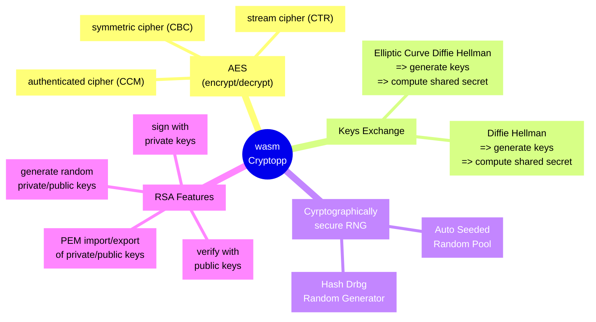
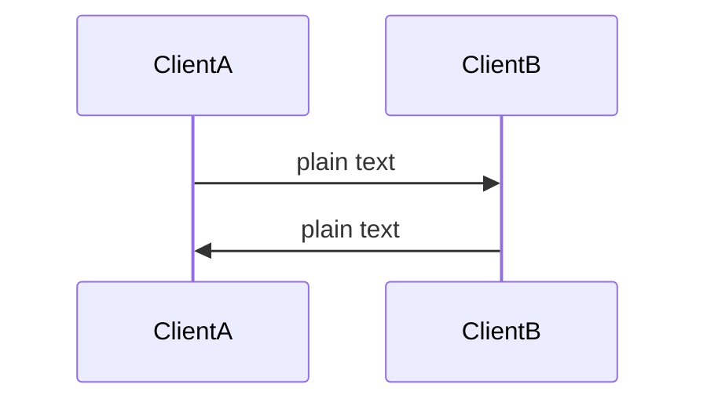
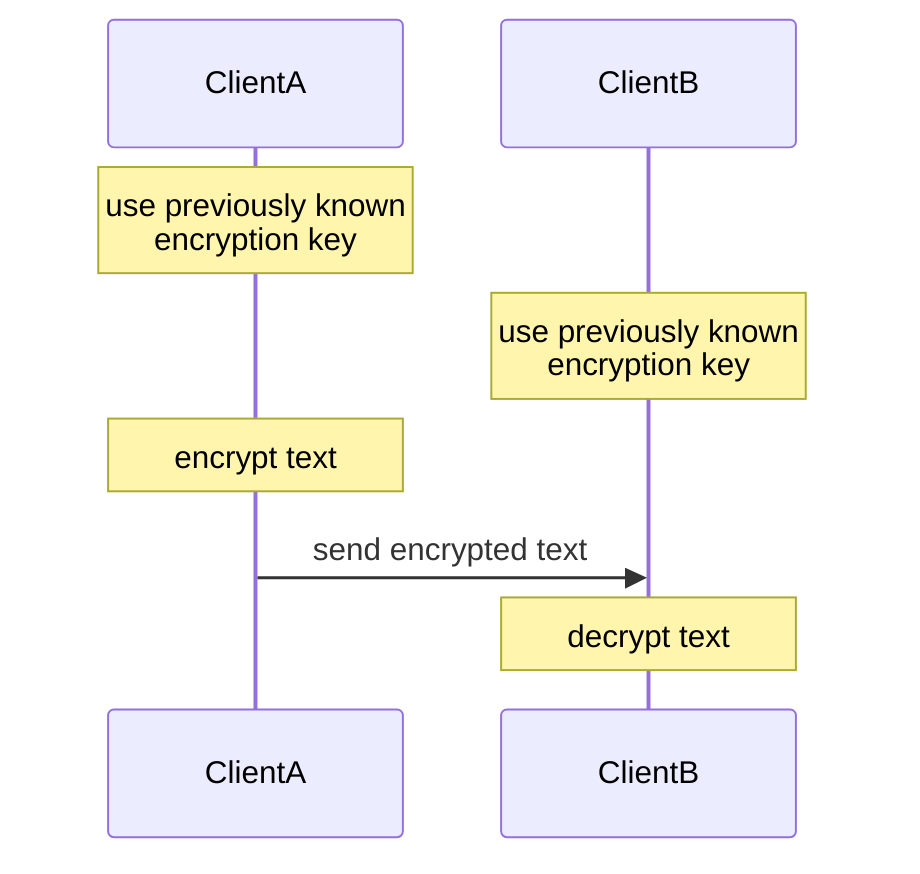
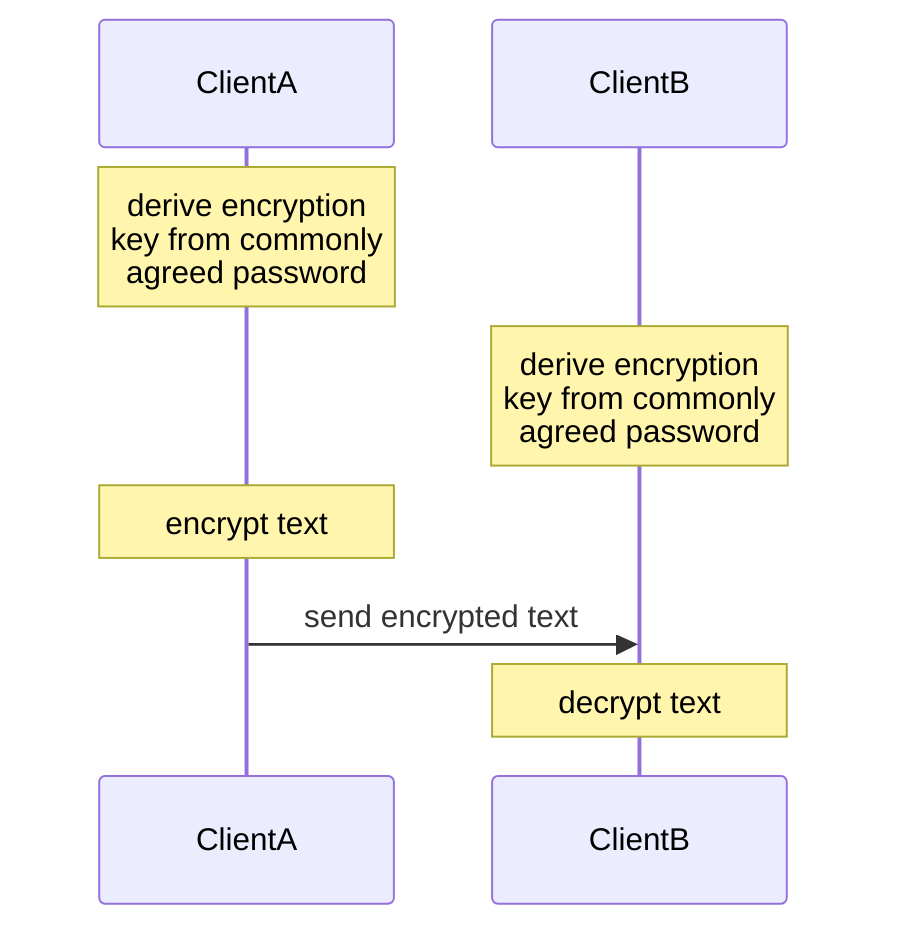
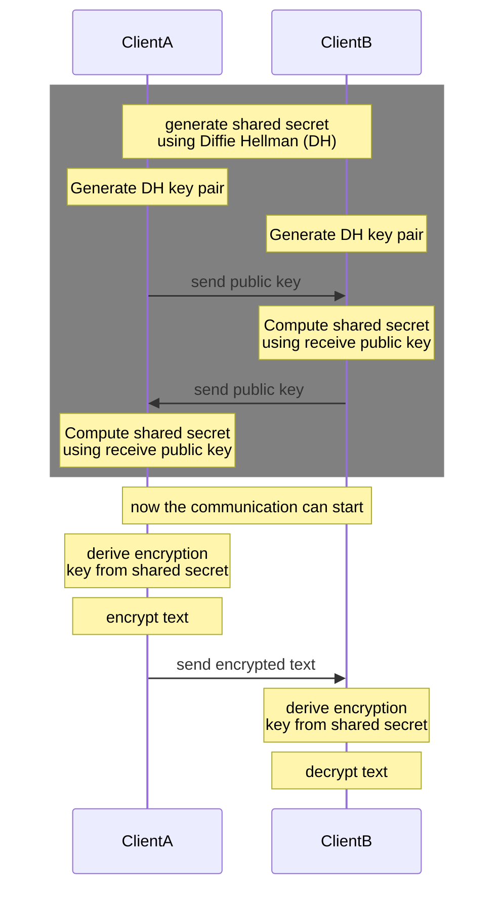
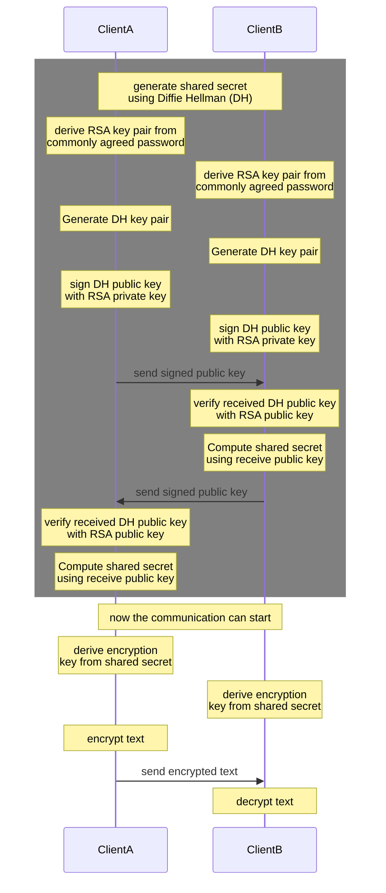

# WebAssembly Crypto++ as a Browser Module

- [WebAssembly Crypto++ as a Browser Module](#webassembly-crypto-as-a-browser-module)
- [Description](#description)
- [Online Demo Link(s)](#online-demo-links)
  - [Demo 1: Password Based End To End Encryption (async using WebWorkers)](#demo-1-password-based-end-to-end-encryption-async-using-webworkers)
  - [Demo 2: Derive RSA Keys (async using WebWorkers)](#demo-2-derive-rsa-keys-async-using-webworkers)
  - [Demo 3: Diffie Hellman key exchange (async using WebWorkers)](#demo-3-diffie-hellman-key-exchange-async-using-webworkers)
  - [Demo 4: All Features](#demo-4-all-features)
- [Current Capabilities](#current-capabilities)
  - [RSA features:](#rsa-features)
  - [AES (CBC, CTR, CCM) Symmetric Cipher:](#aes-cbc-ctr-ccm-symmetric-cipher)
  - [Diffie Hellman (DH) and Elliptic Curve Diffie Hellman (ECDH) Client:](#diffie-hellman-dh-and-elliptic-curve-diffie-hellman-ecdh-client)
  - [Auto Seeded Random Pool:](#auto-seeded-random-pool)
  - [Hash Drbg Random Generator:](#hash-drbg-random-generator)
- [Diagrams](#diagrams)
  - [Problematic Design 1:](#problematic-design-1)
  - [Problematic Design 2:](#problematic-design-2)
  - [Problematic Design 3:](#problematic-design-3)
  - [Problematic Design 4:](#problematic-design-4)
  - [Safer Design:](#safer-design)
  - [To case of "Why would anyone need this?":](#to-case-of-why-would-anyone-need-this)
- [Dependencies](#dependencies)
  - [Dependency: Emscripten 3.1.74](#dependency-emscripten-3174)
  - [Dependency: cryptopp 8.2.0](#dependency-cryptopp-820)
  - [Dependency: cryptopp-pem 8.2.0](#dependency-cryptopp-pem-820)
- [How to Build](#how-to-build)
  - [Build Everything](#build-everything)
  - [Build Everything (details)](#build-everything-details)
- [Thanks for watching!](#thanks-for-watching)


# Description

Browser cryptography capabilities are limited, this project attempt to fix that.

Definition file is provided for TypeScript (or limited JavaScript autocompletion).

Works in a Node.js context (assuming you don't like the crypto module...?).

Unit tested:
* C++ code rely on GoogleTest
* TypeScript code rely on jest

Alternatively, It should be possible to expose most Crypto++ capabilities.

The size and memory footprint of this project was optimized when possible,

Here are the (release) built js/wasm files:
```bash
[4.0K]  build/
├── [111K]  wasm-cryptopp.js
└── [814K]  wasm-cryptopp.wasm
```

Here are the (transpiled, minified and bundled) js files of the async E2E sample:
```bash
[4.0K]  samples/end-to-end-encrypted-connection-async/
├── [4.0K]  dist
│   ├── [ 24K]  main.js
│   ├── [3.0K]  worker-derive-rsa-key.js
│   └── [2.7K]  worker-diffie-hellman.js
└── [1.4K]  index.html
```

---

# Online Demo Link(s)

**`/!\ important /!\`**

## Demo 1: Password Based End To End Encryption (async using WebWorkers)

[./samples/end-to-end-encrypted-connection-async/index.html](http://guillaumebouchetepitech.github.io/wasm-cryptopp-as-module/samples/end-to-end-encrypted-connection-async/index.html)

Please consider looking at the [Diagrams](#diagrams) part for some a documented explanation.

## Demo 2: Derive RSA Keys (async using WebWorkers)
[./samples/derive-rsa-keys-async/index.html](http://guillaumebouchetepitech.github.io/wasm-cryptopp-as-module/samples/derive-rsa-keys-async/index.html)

## Demo 3: Diffie Hellman key exchange (async using WebWorkers)
[./samples/diffie-hellman-key-exchange-async/index.html](http://guillaumebouchetepitech.github.io/wasm-cryptopp-as-module/samples/diffie-hellman-key-exchange-async/index.html)

## Demo 4: All Features
[./samples/basic/index.html](http://guillaumebouchetepitech.github.io/wasm-cryptopp-as-module/samples/basic/index.html)

**`/!\ important /!\`**

# Current Capabilities


```mermaid

mindmap
  cloud((wasm<br>Cryptopp))
    ["AES<br>(encrypt/decrypt)"]
      ["symmetric cipher (CBC)"]
      ["stream cipher (CTR)"]
      ["authenticated cipher (CCM)"]
    ["Keys Exchange"]
      ["Diffie Hellman<br>=#62; generate keys<br>=#62; compute shared secret"]
      ["Elliptic Curve Diffie Hellman<br>=#62; generate keys<br>=#62; compute shared secret"]
    [Cyrptographically<br>secure RNG]
      ["Auto Seeded<br>Random Pool"]
      ["Hash Drbg<br>Random Generator"]
    ["RSA Features"]
      ["generate random<br>private/public keys"]
      ["PEM import/export<br>of private/public keys"]
      ["sign with<br>private keys"]
      ["verify with<br>public keys"]

```

## RSA features:
  * generate random private keys
  * PEM import/export of private/public keys (will accept/return string values)
  * sign with private keys
  * verify with public keys

## AES (CBC, CTR, CCM) Symmetric Cipher:
  * initialize with key/iv
  * encrypt/decrypt

## Diffie Hellman (DH) and Elliptic Curve Diffie Hellman (ECDH) Client:
  * generateKeys
  * computeSharedSecret

## Auto Seeded Random Pool:
  * cryptographic secure random umber generation of N bytes (as an hexadecimal string)

## Hash Drbg Random Generator:
  * cryptographic secure pseudo random umber generation of N bytes (as an hexadecimal string)

---

# Diagrams

## Problematic Design 1:


```mermaid
sequenceDiagram
    ClientA->>ClientB: plain text
    ClientB->>ClientA: plain text
```
Pro(s):
* It's... simple?

Con(s):
* Anyone listening can know what was exchanged

## Problematic Design 2:


```mermaid
sequenceDiagram
    Note over ClientA: use previously known<br>encryption key
    Note over ClientB: use previously known<br>encryption key
    Note over ClientA: encrypt text
    ClientA->>ClientB: send encrypted text
    Note over ClientB: decrypt text
```
Pro(s):
* It's a little bit safer

Cons(s):
* Encryption key likely stored (and therefore possibly retrieved)
  * the encryption the key is then used against any messages that were spied and stored

## Problematic Design 3:


```mermaid
sequenceDiagram

    Note over ClientA: derive encryption<br>key from commonly<br>agreed password
    Note over ClientB: derive encryption<br>key from commonly<br>agreed password
    Note over ClientA: encrypt text
    ClientA->>ClientB: send encrypted text
    Note over ClientB: decrypt text
```
Pro(s):
* the commonly shared password does not need to be stored
* the keys used are disposable and can be re-generated from the password

Con(s):
* need a "face to face agreed" password
* same key all along, the key is never "refreshed"
  * possible brute force of the encryption key
    * the encryption the key is then used against any messages that were spied and stored


## Problematic Design 4:


```mermaid
sequenceDiagram

    rect rgb(128, 128, 128)
      Note over ClientA,ClientB: generate shared secret<br>using Diffie Hellman (DH)

      Note over ClientA: Generate DH key pair
      Note over ClientB: Generate DH key pair

      ClientA->>ClientB: send public key
      Note over ClientB: Compute shared secret<br>using receive public key
      ClientB->>ClientA: send public key
      Note over ClientA: Compute shared secret<br>using receive public key
    end

    Note over ClientA,ClientB: now the communication can start

    Note over ClientA: derive encryption<br>key from shared secret
    Note over ClientA: encrypt text
    ClientA->>ClientB: send encrypted text
    Note over ClientB: derive encryption<br>key from shared secret
    Note over ClientB: decrypt text
```
Pro(s):
* It's a kind of safe
* the key is not stored but disposable
* the key can be never the same between each new session
* the feature "Perfect Forward Secrecy" become available
  * the ability to change the encryption key "on the fly"

Con(s):
* a "Man in the Middle" (MIM) attack can allow someone to pass for one of the 2 clients
  * effectively acting as a "bridge" (proxy) between the ClientA and ClientB
    * the MIM actor can read the message in their unencrypted state

## Safer Design:

**Note:** This is a diagram of what happen in this demo: [Demo 1: Password Based End To End Encryption (async using WebWorkers)](#demo-1-password-based-end-to-end-encryption-async-using-webworkers)


```mermaid
sequenceDiagram

    rect rgb(128, 128, 128)
      Note over ClientA,ClientB: generate shared secret<br>using Diffie Hellman (DH)

      Note over ClientA: derive RSA key pair from<br>commonly agreed password
      Note over ClientB: derive RSA key pair from<br>commonly agreed password

      Note over ClientA: Generate DH key pair
      Note over ClientB: Generate DH key pair

      Note over ClientA: sign DH public key<br>with RSA private key
      Note over ClientB: sign DH public key<br>with RSA private key

      ClientA->>ClientB: send signed public key

      Note over ClientB: verify received DH public key<br>with RSA public key
      Note over ClientB: Compute shared secret<br>using receive public key
      ClientB->>ClientA: send signed public key

      Note over ClientA: verify received DH public key<br>with RSA public key
      Note over ClientA: Compute shared secret<br>using receive public key
    end

    Note over ClientA,ClientB: now the communication can start

    Note over ClientA: derive encryption<br>key from shared secret
    Note over ClientB: derive encryption<br>key from shared secret
    Note over ClientA: encrypt text
    ClientA->>ClientB: send encrypted text
    Note over ClientB: decrypt text
```
Pro(s):
* the commonly shared password does not need to be stored
* the keys used are disposable and can be re-generated from the password
* since the exchange is signed/verified with a RSA key pair a "Man in the Middle" attack is impossible
* the key can be never the same between each new session
* the feature "Perfect Forward Secrecy" become available
  * the ability to change the encryption key "on the fly"

Con(s)
* need a "face to face agreed" password

## To case of "Why would anyone need this?":

* not `every messages` send by the users need to be understood by the servers as they are routing those to their intended recipient(s)

* an "End to End encryption" can be implemented inside a webpage entirely working on the client side browser
  * which is made possible by relying on the port of libcryptopp to WebAssembly (...that this github repo does...)

* The case of "HTTPS"
  * it's not enough to ensure an "in-between users" confidentiality
  * the encryption is between the "users" and the "servers"
    * that means the "servers" are able to read the messages sent by the "users"

# Dependencies

## Dependency: Emscripten 3.1.74

[Github Link](https://github.com/emscripten-core/emsdk)

This dependency will be downloaded and built with the `Build Everything` method below

## Dependency: cryptopp 8.2.0

[Github Link](https://github.com/weidai11/cryptopp)

This dependency will be downloaded and built with the `Build Everything` method below

## Dependency: cryptopp-pem 8.2.0

[Github Link](https://github.com/noloader/cryptopp-pem)

This dependency will be downloaded and built with the `Build Everything` method below


# How to Build

## Build Everything

```bash
chmod +x ./sh_everything.sh
./sh_everything.sh
```

## Build Everything (details)

This will:
- handle the c++-to-wasm compiler
  - **[if not found]** will download emsdk (locally)
  - will initialize emscripten compiler (includes setting up the env)
- handle thirdparty libraries
  - **[if not found]** will download libraries (locally)
    - `libcrypto++`
    - `libcrypto++-pem`
  - **[if not built]** compile libraries (wasm byte code library)
    - `libcrypto++`
    - `libcrypto++-pem`
- generate the wasm module
  - **[if not built]** compile the C++ wrapper code
    - and inject what's in `./src/js/post.js`
- the links to the samples demoed at the top of this readme can be built locally
  - the package.json contains several script to that effect
    - make sure to run `npm install` first
    - then consider which sample you wishes to build
      - ex:the `password based end to end encryption` script is:
        - `npm run build-end-to-end-encrypted-connection-async`


# Thanks for watching!
