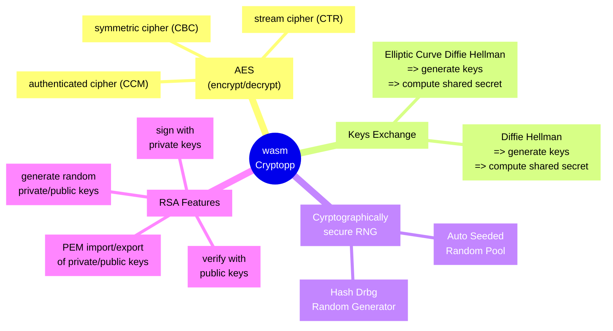
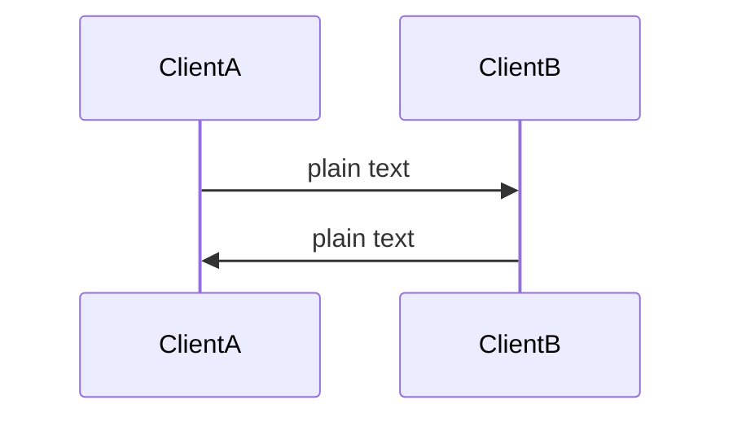
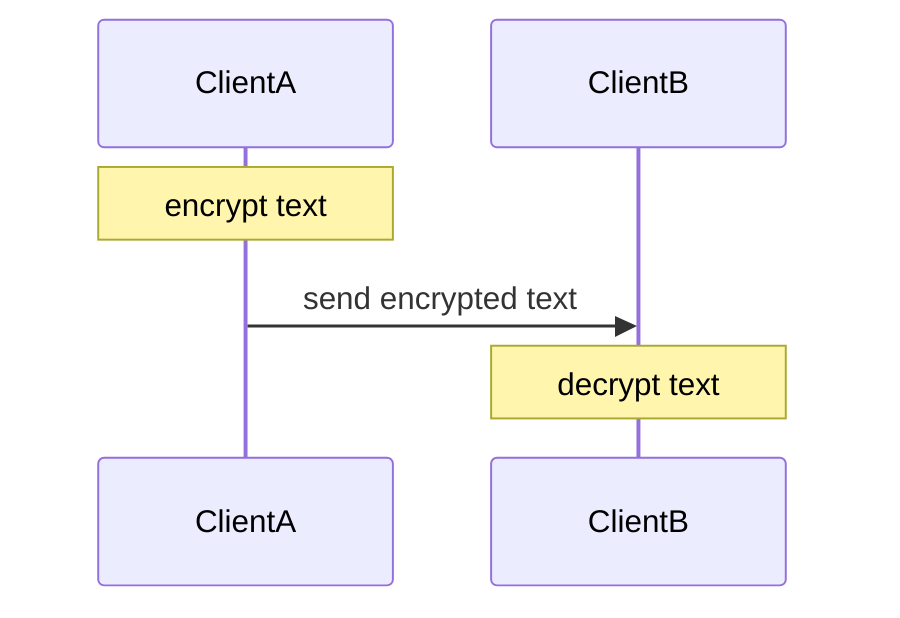
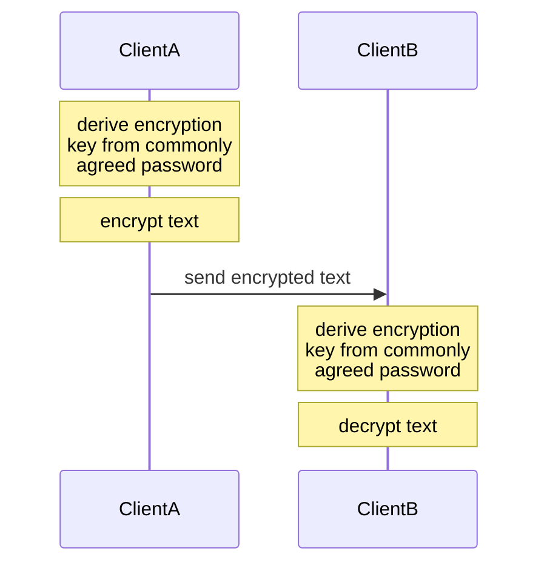
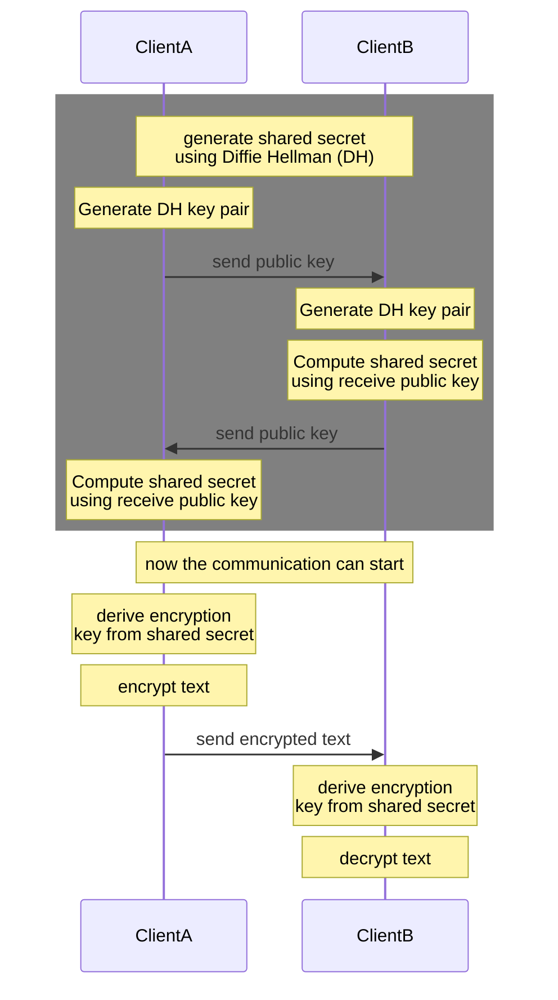
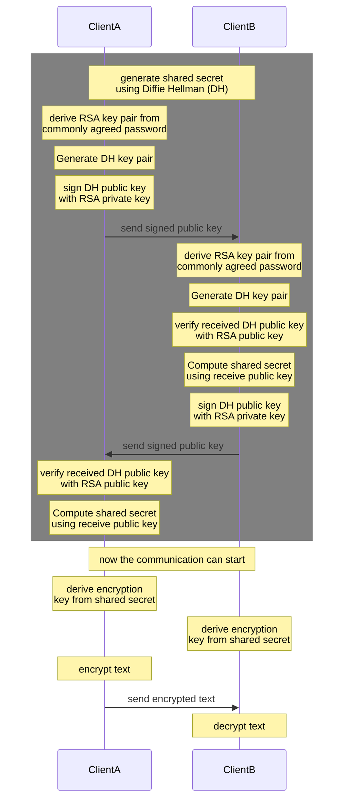

# WebAssembly Crypto++ as a Browser Module

- [WebAssembly Crypto++ as a Browser Module](#webassembly-crypto-as-a-browser-module)
  - [Description](#description)
  - [Online Demo Link(s)](#online-demo-links)
    - [Demo 1: Password Based End To End Encryption (async using WebWorkers)](#demo-1-password-based-end-to-end-encryption-async-using-webworkers)
    - [Demo 2: Derive RSA Keys (async using WebWorkers)](#demo-2-derive-rsa-keys-async-using-webworkers)
    - [Demo 3: Diffie Hellman key exchange (async using WebWorkers)](#demo-3-diffie-hellman-key-exchange-async-using-webworkers)
    - [Demo 4: All Features](#demo-4-all-features)
  - [Current Capabilities](#current-capabilities)
    - [RSA features:](#rsa-features)
    - [AES (CBC, CTR, CCM) Symmetric Cipher:](#aes-cbc-ctr-ccm-symmetric-cipher)
    - [Diffie Hellman (DH) and Elliptic Curve Diffie Hellman (ECDH) Client:](#diffie-hellman-dh-and-elliptic-curve-diffie-hellman-ecdh-client)
    - [Auto Seeded Random Pool:](#auto-seeded-random-pool)
    - [Hash Drbg Random Generator:](#hash-drbg-random-generator)
  - [Diagrams](#diagrams)
    - [Problematic Design 1:](#problematic-design-1)
    - [Problematic Design 2:](#problematic-design-2)
    - [Problematic Design 3:](#problematic-design-3)
    - [Problematic Design 4:](#problematic-design-4)
    - [Safer Design:](#safer-design)
    - [To answer the "why would anyone need this?":](#to-answer-the-why-would-anyone-need-this)
    - [Downside](#downside)
  - [Dependencies](#dependencies)
    - [Dependency: Emscripten 3.1.26](#dependency-emscripten-3126)
    - [Dependency: cryptopp 8.2.0](#dependency-cryptopp-820)
  - [How to Build](#how-to-build)
    - [Build Everything](#build-everything)
    - [Build Everything (details)](#build-everything-details)
  - [Thanks for watching!](#thanks-for-watching)


## Description

Browser cryptography capabilities are limited, this project attempt to fix that.

Definition file is provided for TypeScript (or limited JavaScript autocompletion).

Works in a Node.js context (assuming you don't like the crypto module...?).

Unit tested:
* C++ code rely on GoogleTest
* TypeScript code rely on jest

It should be possible to expose most Crypto++ capabilities.

---

## Online Demo Link(s)

**`/!\ important /!\`**

### Demo 1: Password Based End To End Encryption (async using WebWorkers)
[./samples/end-to-end-encrypted-connection-async/index.html](http://guillaumebouchetepitech.github.io/wasm-cryptopp-as-module/samples/end-to-end-encrypted-connection-async/index.html)

### Demo 2: Derive RSA Keys (async using WebWorkers)
[./samples/derive-rsa-keys-async/index.html](http://guillaumebouchetepitech.github.io/wasm-cryptopp-as-module/samples/derive-rsa-keys-async/index.html)

### Demo 3: Diffie Hellman key exchange (async using WebWorkers)
[./samples/diffie-hellman-key-exchange-async/index.html](http://guillaumebouchetepitech.github.io/wasm-cryptopp-as-module/samples/diffie-hellman-key-exchange-async/index.html)

### Demo 4: All Features
[./samples/basic/index.html](http://guillaumebouchetepitech.github.io/wasm-cryptopp-as-module/samples/basic/index.html)

**`/!\ important /!\`**

## Current Capabilities


```mermaid

mindmap
  cloud((wasm<br>Cryptopp))
    ["AES<br>(encrypt/decrypt)"]
      ["symmetric cipher (CBC)"]
      ["stream cipher (CTR)"]
      ["authenticated cipher (CCM)"]
    ["Keys Exchange"]
      ["Diffie Hellman<br>=#62; generate keys<br>=#62; compute shared secret"]
      ["Elliptic Curve Diffie Hellman<br>=#62; generate keys<br>=#62; compute shared secret"]
    [Cyrptographically<br>secure RNG]
      ["Auto Seeded<br>Random Pool"]
      ["Hash Drbg<br>Random Generator"]
    ["RSA Features"]
      ["generate random<br>private/public keys"]
      ["PEM import/export<br>of private/public keys"]
      ["sign with<br>private keys"]
      ["verify with<br>public keys"]

```

### RSA features:
  * generate random private keys
  * PEM import/export of private/public keys (will accept/return string values)
  * sign with private keys
  * verify with public keys

### AES (CBC, CTR, CCM) Symmetric Cipher:
  * initialize with key/iv
  * encrypt/decrypt

### Diffie Hellman (DH) and Elliptic Curve Diffie Hellman (ECDH) Client:
  * generateKeys
  * computeSharedSecret

### Auto Seeded Random Pool:
  * cryptographic secure random umber generation of N bytes (as an hexadecimal string)

### Hash Drbg Random Generator:
  * cryptographic secure pseudo random umber generation of N bytes (as an hexadecimal string)

---

## Diagrams

### Problematic Design 1:


```mermaid
sequenceDiagram
    ClientA->>ClientB: plain text
    ClientB->>ClientA: plain text
```
Issue(s):
* Anyone listening can know what was exchanged

### Problematic Design 2:


```mermaid
sequenceDiagram
    Note over ClientA: encrypt text
    ClientA->>ClientB: send encrypted text
    Note over ClientB: decrypt text
```
Issue(s):
* Encryption key likely stored (and therefore possibly retrieved)
  * then the key is then used against previously spied and stored exchanged messages

### Problematic Design 3:


```mermaid
sequenceDiagram

    Note over ClientA: derive encryption<br>key from commonly<br>agreed password
    Note over ClientA: encrypt text
    ClientA->>ClientB: send encrypted text
    Note over ClientB: derive encryption<br>key from commonly<br>agreed password
    Note over ClientB: decrypt text
```
Issue(s):
* same key all along, the key is never "refreshed"
  * possibly brute force encryption key
    * then the key is then used against previously spied and stored exchanged messages

### Problematic Design 4:


```mermaid
sequenceDiagram

    rect rgb(128, 128, 128)
      Note over ClientA,ClientB: generate shared secret<br>using Diffie Hellman (DH)

      Note over ClientA: Generate DH key pair
      ClientA->>ClientB: send public key
      Note over ClientB: Generate DH key pair
      Note over ClientB: Compute shared secret<br>using receive public key
      ClientB->>ClientA: send public key
      Note over ClientA: Compute shared secret<br>using receive public key
    end

    Note over ClientA,ClientB: now the communication can start

    Note over ClientA: derive encryption<br>key from shared secret
    Note over ClientA: encrypt text
    ClientA->>ClientB: send encrypted text
    Note over ClientB: derive encryption<br>key from shared secret
    Note over ClientB: decrypt text
```
Issue(s):
* a "Man in the Middle" (MIM) attack can allow someone to pass for one of the 2 clients
  * effectively acting as a "bridge" (proxy) between the ClientA and ClientB
    * and being capable to read the message in their unencrypted state

### Safer Design:


```mermaid
sequenceDiagram

    rect rgb(128, 128, 128)
      Note over ClientA,ClientB: generate shared secret<br>using Diffie Hellman (DH)

      Note over ClientA: derive RSA key pair from<br>commonly agreed password
      Note over ClientA: Generate DH key pair
      Note over ClientA: sign DH public key<br>with RSA private key
      ClientA->>ClientB: send signed public key

      Note over ClientB: derive RSA key pair from<br>commonly agreed password
      Note over ClientB: Generate DH key pair
      Note over ClientB: verify received DH public key<br>with RSA public key
      Note over ClientB: Compute shared secret<br>using receive public key
      Note over ClientB: sign DH public key<br>with RSA private key
      ClientB->>ClientA: send signed public key

      Note over ClientA: verify received DH public key<br>with RSA public key
      Note over ClientA: Compute shared secret<br>using receive public key
    end

    Note over ClientA,ClientB: now the communication can start

    Note over ClientA: derive encryption<br>key from shared secret
    Note over ClientB: derive encryption<br>key from shared secret
    Note over ClientA: encrypt text
    ClientA->>ClientB: send encrypted text
    Note over ClientB: decrypt text
```
Issues(s) solved:
* the commonly shared password does not need to be stored
* the keys used are disposable and can be re-generated from the password
* since the exchange is signed/verified with a RSA key pair a "Man in the Middle" attack is impossible
* the feature "Perfect Forward Secrecy" become available
  * the ability to change the encryption key "on the fly"

### To answer the "why would anyone need this?":
* not `every messages` send by users need to be understood by the server(s) that will route it to their intended recipient(s)
* this "End to End" encryption can be implemented in a webpage entirely on the client side (since it relies on libcryptopp ported to WebAssembly)
### Downside
* all users need to know a commonly agreed password, either something that can be guessed, or something that was agreed face to face.

## Dependencies

### Dependency: Emscripten 3.1.26

[Github Link](https://github.com/emscripten-core/emsdk)

This dependency will be downloaded and built with the `Build Everything` method below

### Dependency: cryptopp 8.2.0

[Github Link](https://github.com/weidai11/cryptopp)

This dependency will be downloaded and built with the `Build Everything` method below

## How to Build

### Build Everything

```bash
chmod +x ./sh_everything.sh
./sh_everything.sh
```

### Build Everything (details)

This will:
- handle the c++-to-wasm compiler
  - **[if not found]** will download emsdk (locally)
  - will initialize emscripten compiler (includes setting up the env)
- handle thirdparty libraries
  - **[if not found]** will download libraries (locally)
    - `libcrypto++`
    - `libcrypto++-pem`
  - **[if not build]** compile libraries (wasm byte code library)
    - `libcrypto++`
    - `libcrypto++-pem`
- generate the wasm module
  - **[if not build]** compile the C++ wrapper code
    - and inject what's in `./src/js/post.js`

## Thanks for watching!
